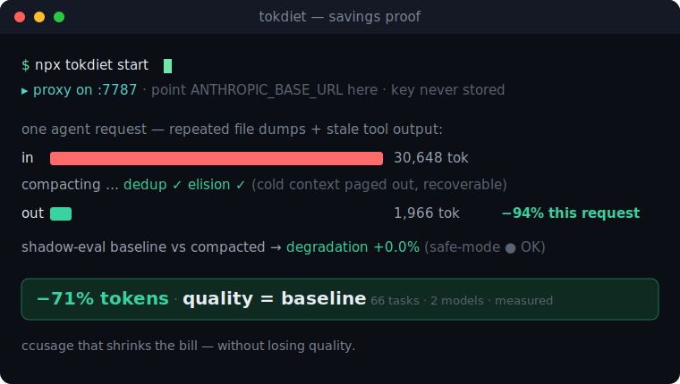

# tokdiet

**Your AI agent is paying to send the same file dump five times.** `tokdiet` is a local proxy that sits between your agent and the model API, meters every token, puts your bloated context **on a diet** — and *proves* the answer didn't get worse.

> **ccusage that shrinks the bill — without losing quality.**



[](https://github.com/agiwhitelist/tokdiet/actions/workflows/ci.yml)    

🌐 **Live demo (watch one request lose the weight):** [agiwhitelist.github.io/tokdiet](https://agiwhitelist.github.io/tokdiet/)
📝 **Launch write-up + full benchmark methodology:** [I cut an AI agent's input tokens by 71% and quality held — here's the 66-task benchmark](https://dev.to/agiwhitelist/i-cut-an-ai-agents-input-tokens-by-71-and-quality-held-heres-the-66-task-benchmark-2b97)

---

## The proof (this is the whole point)

Every "context optimizer" cuts tokens. The scary question is the one they can't answer:

> *"If I cut the context, does the model get dumber?"*

So we measured it. A **66-task** A/B benchmark across 6 categories on a **real model** (MiniMax‑M3), each task run **twice** — full context (baseline) vs through `tokdiet` (governed) — graded against the **known answer**, repeated ×3 and majority‑voted to cancel model noise:

```
                       baseline      tokdiet
  input tokens          5.07M    →    1.46M       −71%
  quality (66 tasks)     64/66        63/66        ≈ parity (95–97%)
  ─────────────────────────────────────────────────────────
  198 paired runs · LLM-judge 92% similarity · confirmed on a 2nd model (MiniMax-M2.5: −72%)
```

**−71% tokens, quality on par with baseline.** Real requests, real grading — not a mock. The ~1–2 task gap is model nondeterminism plus the model *declining to echo a secret* — not context loss; the hardest "needle buried in junk" adversarial cases pass, because `tokdiet` doesn't delete blindly — it pages cold context out *recoverably* and protects anything on‑topic. Reproduce it yourself: `node bench/run.mjs` (needs an API key in env).

### How it compares

|                                              | shows your bill | cuts the bill | proves quality held |
|----------------------------------------------|:---------------:|:-------------:|:-------------------:|
| eyeballing `/cost`, ccusage                  |        ✅        |       ❌       |          ❌          |
| manual `/compact`, hand-pruning context      |        ❌        |    ✅ (blind)  |          ❌          |
| **tokdiet**                                  |        ✅        |       ✅       |  ✅ measured + auto safe-mode |

Everyone shows the bill or cuts it blind. tokdiet is the one that **cuts it and proves the model didn't get dumber** — and stops cutting the moment it might.

---

## Quick start

```bash
# 1. Start the proxy (and live dashboard) — no install needed
npx tokdiet start
```

```bash
# 2. Point your agent at the proxy instead of the real API
export ANTHROPIC_BASE_URL=http://localhost:7787
export OPENAI_BASE_URL=http://localhost:7787/v1
```

Now run your agent (Claude Code, Cursor, Codex, your own script) as usual. Traffic flows through `tokdiet`, gets metered and compacted, and is forwarded upstream unchanged in every way that matters.

**Your API key stays with you.** `tokdiet` reads `x-api-key` / `Authorization` only to forward them upstream. They are **never written to SQLite and never written to any log**. And it's **fail‑open**: if anything inside the governor errors, it falls back to transparent passthrough — the proxy will never break your request or surface its own 5xx.

> Default ports: proxy `7787`, dashboard `7878`. Override with `--port` / `--dashboard-port`.

---

## Install via Claude Code

`tokdiet` ships as a Claude Code plugin via its own marketplace:

```shell
/plugin marketplace add agiwhitelist/tokdiet
/plugin install tokdiet
```

**What the plugin does — and what it doesn't.** The plugin ships a *lightweight
metering hook* plus a `/tokdiet` command. The hook runs on every tool call
(`PreToolUse` + `PostToolUse`) and logs tool I/O byte sizes to
`~/.tokdiet/tool-meter.log`. **It does not save tokens by itself** — a plugin
can't set `ANTHROPIC_BASE_URL` for the Claude Code process, so it can't route
your traffic through the compacting proxy.

The actual token savings come from the **proxy**. Start it and point Claude Code
at it (this is what gives you the ~−71% token reduction):

```bash
npx tokdiet start
export ANTHROPIC_BASE_URL=http://localhost:7787   # then launch Claude Code from this shell
```

View metered tokens, cost, and savings any time with `npx tokdiet report`, or run
`/tokdiet` inside Claude Code for these instructions.

---

## Works with Claude Code (and it's careful about it)

Claude Code is the flagship use case, and it has two landmines a naive compacting proxy walks straight into. `tokdiet` handles both:

- **Prompt caching.** Claude Code marks a cached prefix with `cache_control`; cached input costs ~10% of normal. Rewriting that prefix invalidates the cache and can make a request cost **more**. `tokdiet` is **cache‑aware** — it never touches content at or before a `cache_control` breakpoint.
- **Extended thinking.** Claude Code sends signed `thinking` blocks that Anthropic requires returned verbatim; touching one is an instant `400`. `tokdiet` is **thinking‑safe** — signed/thinking blocks are never surfaced or mutated.

Both are covered by regression tests (`tests/cc-compat.test.ts`).

> **A note on honesty:** the dollar‑savings story applies to **pay‑per‑token API keys** (MiniMax, Anthropic API, OpenAI, …). On a flat Claude **subscription** there are no per‑token charges to cut, so the value there is metering, budgets, and the live dashboard — not dollars.

---

## How it works

`tokdiet` is a streaming reverse proxy. SSE responses are proxied **incrementally** (never buffered whole), so your agent's tokens still stream in real time.

```
                            tokdiet (localhost:7787)
   agent  ─────────────────────────────────────────────────────────────►  model API
 (Claude  request    ┌───────────┐  ┌───────┐  ┌────────┐  ┌───────────┐   (Anthropic /
  Code,  ──────────► │interceptor│─►│ meter │─►│ budget │─►│ compactor │──►   OpenAI /
  Cursor, raw key    └───────────┘  └───────┘  └────────┘  └─────┬─────┘      Gemini /
  Codex,  forwarded   detect          count      session/        │ dedup / elision /  MiniMax)
  …)                  provider,       tokens     day / repo      │ mid-summarize
                      keep body        & cost     limits          ▼
                      byte-faithful                          ┌───────────────┐
   response                                                  │ quality guard │
 ◄──────────────────────────────────────────────────────────┤ shadow-eval + │
   streamed back, token-for-token                            │  safe-mode    │
                                          ┌──────────────┐   └───────┬───────┘
                                          │ store(SQLite)│◄──────────┘
                                          │ + dashboard  │  telemetry, savings, degradation
                                          └──────────────┘
```

### Context as virtual memory (the idea)

Blind compaction is "delete and pray." `tokdiet` treats your context like **virtual memory**: hot content (recent, pinned, relevant to the current question) stays resident; cold content (stale, redundant) is **paged out** to a local store as a recoverable stub — *not deleted*. The full block is kept in SQLite keyed by an id, so it can be audited and (roadmap) **paged back in on demand** when the model actually needs it.

### The 3 quality mechanisms

| Mechanism | What it does |
|-----------|--------------|
| **Shadow‑eval** | Re‑runs a sampled fraction of compacted requests against the *un‑compacted* baseline and scores the divergence (0 = identical, 100 = unrelated). This is the measurement that answers "did quality drop?" |
| **Quality budget** | A hard ceiling on acceptable measured degradation (`qualityBudget.maxDegradationPct`, default **2%**). As you approach it, the compactor restricts itself to its safest strategies. |
| **Safe‑mode** | If rolling degradation *exceeds* the budget, the offending strategy is disabled (per‑strategy) and a `safe-mode` event fires. **Savings stop before quality does.** |

### Compaction strategies (safest‑first)

1. **Dedup** — *loss‑free.* When the same large block is re‑pasted across a conversation, keep the freshest copy verbatim and replace earlier copies with a pointer marker. Works on near‑duplicates too (a file re‑pasted with a few lines changed), not just byte‑identical ones.
2. **Elision** — *recoverable.* Page out the bulk of *old* tool results (file dumps, command output), keeping a preview **plus the salient lines** (errors, ids, `KEY=VALUE`, URLs, paths, numbers) and storing the full body for recovery. Recent, pinned, and question‑relevant results are kept intact.
3. **Mid‑summarize** *(off by default)* — summarize mid‑history with a cheap model. Opt‑in (it costs money).

---

## Commands

```bash
tokdiet <command> [flags]   # alias: td
```

| Command | What it does | Key flags |
|---------|--------------|-----------|
| `start` | Run the proxy + live dashboard | `--port`, `--dashboard-port`, `--no-dashboard`, `--config <path>` |
| `report` | Print a usage report (or export) | `--since <days>`, `--json`, `--csv <file>`, `--config <path>` |
| `init` | Scaffold `tokdiet.config.json` in the cwd | `--force` |
| `install-claude-plugin` | Install an idempotent Claude Code metering hook | `--settings <path>` |

---

## Configuration

Run `tokdiet init` to create `tokdiet.config.json`, or pass one with `--config`. All fields are optional and merge over sensible defaults.

| Field | Default | Description |
|-------|---------|-------------|
| `proxyPort` / `dashboardPort` | `7787` / `7878` | Ports (both bound to loopback only). |
| `dashboardEnabled` | `true` | Start the dashboard alongside the proxy. |
| `contextWindowTokens` | `"auto"` | Window size for utilization %; `"auto"` infers from the model. |
| `contextUtilizationThreshold` | `0.7` | Compaction triggers once input utilization reaches this fraction. |
| `onBudgetExceeded` | `"warn"` | `"warn"` \| `"compact"` \| `"block"` when a spend budget is hit. |
| `budgets.perSessionUSD` / `perDayUSD` / `perRepoMonthlyUSD` | `5` / `50` / `400` | Spend ceilings (any may be `null`). |
| `compaction.strategies.{elision,dedup,midSummarize}` | `true`/`true`/`false` | Per‑strategy switches. |
| `compaction.keepRecentToolResults` | `4` | Most‑recent tool results always kept intact. |
| `compaction.minToolResultTokens` | `500` | Only elide tool results at least this large. |
| `compaction.elisionPreviewChars` / `elisionSalientLines` | `240` / `12` | How much of a paged‑out block to keep (head + salient lines). |
| `compaction.relevanceProtect` | `true` | Shield blocks lexically on‑topic with the latest question. |
| `compaction.recoverable` | `true` | Persist paged‑out blocks for recovery/audit (virtual memory). |
| `compaction.protectCachedPrefix` | `true` | Never compact a provider cache (`cache_control`) prefix. |
| `compaction.semanticDedup` | `true` | Collapse near‑duplicates, not just exact ones. |
| `qualityBudget.maxDegradationPct` | `2.0` | Max measured degradation before safe‑mode trips. |
| `shadowEval.enabled` / `sampleRate` | `true` / `0.05` | Whether/how often to shadow‑evaluate. |
| `shadowEval.judge` | `"heuristic"` | `"heuristic"` \| `"llm"` (`"embedding"` reserved, falls back to heuristic). |
| `shadowEval.judgeModel` | `"claude-haiku-4"` | Cheap model for the LLM judge / mid‑summarize. |
| `pageFault` | `{ enabled: true, maxReinjections: 1 }` | Re‑inject a paged‑out block if the model can't answer without it. |
| `safeMode` | `true` | Auto‑disable a strategy when it exceeds the quality budget. |
| `dataDir` | `~/.tokdiet` | Where SQLite telemetry lives. |
| `pricingPath` | `null` | Override path for `pricing.json` (null = bundled). |

> **Upstream overrides** (point at a non‑default origin — e.g. MiniMax): `TOKDIET_ANTHROPIC_UPSTREAM`, `TOKDIET_OPENAI_UPSTREAM`, `TOKDIET_GEMINI_UPSTREAM` (legacy `CTXGOV_*_UPSTREAM` still read for back‑compat).

---

## Dashboard

With the proxy running, open **http://localhost:7878** — a single self‑contained page that streams live updates over SSE (loopback only; your cost data never leaves the machine):

```
┌─ tokdiet ─────────────────────────────────────────  ● live · :7878 ─┐
│                                                                       │
│  SESSION  claude-code › my-repo › MiniMax-M3                          │
│  context  ███████████████████░░░░░░░░░░  64%   128,402 / 200,000 tok  │
│                                                                       │
│  ┌── TODAY ────────────────┐   ┌── SAVED (cumulative) ─────────────┐  │
│  │ sent     1.43M tok       │   │  $12.40  ▁▂▃▅▆▇█  ↑ saving $1.07/h │  │
│  │ saved    3.64M tok       │   │  3.6M tokens never left this box  │  │
│  │ spend    $0.43           │   │  −71.8%  on real traffic          │  │
│  └──────────────────────────┘   └───────────────────────────────────┘  │
│                                                                       │
│  QUALITY GUARD   measured degradation 0.4%  ┃▏▏▏▏▏▏▏▏░░┃ budget 2.0%  │
│                  ▁▁▂▁▁▁▂▁▁▁  72 shadow-evals   safe-mode ● ON · OK     │
│                                                                       │
│  STRATEGY LEADERBOARD            fires    tokens saved     Δ quality   │
│   ▸ dedup          ███████████    312       1.91M           +0.0%      │
│   ▸ elision        ██████         168       1.42M           +0.6%      │
│   ▸ midSummarize   · off ·          0          —              —        │
│                                                                       │
│  BY TOOL   claude-code ██████████ $0.31   cursor ███ $0.09  codex ▍$03 │
└───────────────────────────────────────────────────────────────────────┘
```

Five live screens: **Live session**, **Savings**, **Quality** (degradation + safe‑mode status), **By tool & repo**, and **Strategy leaderboard** — all updating in real time over SSE.

---

## See the savings — no API key required

```bash
npm run build && node scripts/demo.mjs
```

Stands up a **mock** Anthropic upstream on loopback, starts the **real** `tokdiet` proxy in front of it, and sends one realistic bloated agent request through the whole pipeline — actual interceptor, tokenizer, compactor, pricing, telemetry, and shadow‑eval. No external network, no real key. It prints a before/after table proving the *input* shrank while the *answer* stayed identical (so shadow‑eval reports ~0% degradation). *(The scenario is synthetic; your real savings depend on how much your own conversations repeat.)*

---

## Supported providers

| Provider | Endpoint detected | Base URL to set |
|----------|-------------------|-----------------|
| **Anthropic** | `/v1/messages` | `ANTHROPIC_BASE_URL=http://localhost:7787` |
| **OpenAI** | `/v1/chat/completions` | `OPENAI_BASE_URL=http://localhost:7787/v1` |
| **Gemini** | `:generateContent` / `/v1beta/…` | point the Gemini SDK base URL at the proxy |
| **MiniMax** (and any OpenAI/Anthropic‑compatible API) | mimics OpenAI `/v1` & Anthropic `/anthropic` | `OPENAI_BASE_URL=http://localhost:7787/v1` + `TOKDIET_OPENAI_UPSTREAM=https://api.minimax.io` |

Prices come from `pricing.json` (**USD per 1,000,000 tokens**, dated, user‑updatable, hot‑reloaded on `start`; exact match then longest‑prefix).

---

## Roadmap

- **Page‑fault auto‑reinjection** — when the model references a paged‑out id or signals it's missing content, restore it and retry automatically *(partially shipped).*
- **Semantic dedup** *(shipped)* — near‑duplicate collapsing.
- **Embedding judge** — local semantic scoring instead of the heuristic.
- **Self‑calibrating policy** — learn safe aggressiveness per repo from shadow‑eval outcomes.
- **Quality ledger** — auditable before/after + measured‑degradation record.

See `docs/DESIGN-context-virtual-memory.md` for the full design.

---

## Limitations & honesty

- **The default judge is a heuristic** (word/char similarity), not a semantic oracle. Switch `shadowEval.judge` to `"llm"` for a model‑graded score. Embedding judge isn't implemented yet.
- **Shadow‑eval costs money** — it's a real extra upstream request, so it's *sampled* (5% default) and its cost is reported separately.
- **Session inference is heuristic** — per‑session/per‑repo attribution is inferred from request metadata.
- **Page‑fault recovery is limited for streaming** responses.
- **Cost figures are estimates** — only as accurate as your `pricing.json`.

---

## FAQ

### How do I reduce Claude Code token usage and costs?

Point Claude Code at tokdiet instead of the model API directly. tokdiet is a local streaming reverse proxy that sits between your agent and the API, meters every token, and compacts bloated context before it hits the model:

```bash
npx tokdiet start                                 # proxy :7787 + dashboard :7878 (loopback only)
export ANTHROPIC_BASE_URL=http://localhost:7787
export OPENAI_BASE_URL=http://localhost:7787/v1
```

In our 66-task A/B benchmark on a real model (MiniMax‑M3), input tokens dropped from 5.07M to 1.46M (−71%) while quality stayed at parity (baseline 64/66 vs governed 63/66). That is the mechanism behind claude code token optimization here: the proxy shrinks the context, not your workflow.

Note: there is also a Claude Code plugin (`/plugin marketplace add agiwhitelist/tokdiet`), but the plugin is only a metering hook — it cannot set `ANTHROPIC_BASE_URL` for the Claude Code process, so the plugin alone does not save tokens. The proxy is what cuts the bill.

### Claude Code is too expensive — will this actually save me money?

It depends on how you pay. Dollar savings apply to pay-per-token API keys (MiniMax, the Anthropic API, OpenAI), where fewer input tokens means a smaller bill. If you are on a flat Claude subscription there are no per-token charges to cut, so the value there is the metering, budgets, and live local dashboard — you see exactly where tokens go, not a smaller invoice. For anyone hitting "claude code too expensive" on a metered API key, the context compression is where the cost-optimization comes from.

### Is this a ccusage alternative?

Yes — think of it as "ccusage that shrinks the bill." It does ccusage-style token and USD cost tracking, plus a live local dashboard, but it goes further: it is an active llm token cost proxy that compacts context to cut pay-per-token API spend, then runs shadow-eval to verify quality held. If you came looking for a ccusage alternative or a claude code usage monitor that does more than report, that is the difference — measurement plus reduction.

### Does compacting context make the model dumber?

In our testing, no — quality held within model noise. The honest framing: this is "≈ parity," not "lossless." On the 66-task benchmark, baseline scored 64/66 and governed 63/66; across 198 paired runs an LLM judge reported 92% similarity, and a second model (MiniMax-M2.5) confirmed −72% tokens at parity. The ~1-2 task gap is model nondeterminism plus the model declining to echo a secret — not context loss. The hardest "needle buried in junk" adversarial cases pass.

Three mechanisms keep it honest:
- **shadow-eval** re-runs a sampled fraction (5% by default) of compacted requests against the uncompacted baseline and scores divergence (0 = identical … 100 = unrelated). This is the measurement.
- **quality budget** is a hard ceiling on measured degradation (default 2%); near it, the compactor restricts itself to the safest strategies.
- **safe-mode** disables any offending strategy per-strategy when rolling degradation exceeds budget. Savings stop before quality does.

### Is the context compression lossless?

Not overall — be precise here. Only **dedup** is loss-free: re-pasted blocks keep the freshest copy verbatim and replace earlier copies with a marker (it handles near-duplicates too). **Elision** is recoverable, not lossless: it pages out the bulk of old tool results to local SQLite while keeping a preview plus salient lines (errors, ids, KEY=VALUE pairs, URLs, paths, numbers), and stores the full body by id for recovery. We model context as virtual memory — hot content (recent, pinned, question-relevant) stays resident; cold content is paged out as a recoverable stub, not deleted. A third strategy, mid-conversation summarize, is off by default and opt-in because it costs money.

### Does it work with Cursor, Codex, and the Anthropic / OpenAI APIs?

Yes. tokdiet speaks the Anthropic Messages API, OpenAI Chat Completions, Gemini, and MiniMax — plus any OpenAI-compatible or Anthropic-compatible API. Any tool that respects `ANTHROPIC_BASE_URL` / `OPENAI_BASE_URL` works: Claude Code, Cursor, Codex, and custom scripts. So this doubles as a way to reduce Cursor token usage / track Cursor API cost and to do anthropic api cost reduce or openai api cost tracking, all through one self-hosted local proxy.

### Will it break prompt caching or extended thinking?

No — this is regression-tested. tokdiet is cache-aware: it never rewrites a `cache_control` prefix, so it won't break your Claude Code prompt cache. It is also thinking-safe: it never mutates signed/thinking blocks, so it won't trigger a 400 on extended thinking. Because it is a streaming reverse proxy, SSE is proxied incrementally — tokens still stream live to your editor.

### Do you store my API key?

No. API keys are forwarded only — never written to SQLite and never written to any log. The proxy binds to loopback only (no external interface), and it is fail-open: if anything goes wrong in the pipeline, your request still reaches the API. It is self-hosted and local by design; the only thing persisted to SQLite is metering data and paged-out context bodies (kept by id for recovery), not credentials.

### How is this different from LiteLLM or another LLM/AI gateway?

Most self-hosted llm api gateway / ai gateway tools route and log traffic. tokdiet is a litellm alternative focused on cost: it intercepts LLM API traffic as a reverse proxy, then actively does context compression and prompt compression to shrink llm context tokens, and proves the result with shadow-eval. The pipeline is: interceptor → meter → budget → compactor → quality guard → store (SQLite) + dashboard. So it is a local llm proxy dashboard plus a context compression proxy in one, not just a passthrough router.

### How do I verify the token savings myself?

Reproduce the benchmark: `node bench/run.mjs` (you need an API key in env). It runs a 66-task A/B across 6 categories, each task run twice — full context (baseline) vs through tokdiet (governed) — graded against the known answer, repeated x3 and majority-voted to cancel model noise. You will also see live token-usage and cost tracking on the dashboard at `http://localhost:7878` as you work.

### What are the known limitations?

Honest caveats: the default quality judge is a heuristic (an LLM judge is opt-in); shadow-eval costs money because it re-runs sampled requests; session detection is heuristic (inferred, not guaranteed); page-fault recovery is currently limited for streaming responses; and the per-request cost figures are estimates. tiktoken is used for token counting. tokdiet is MIT-licensed and built on TypeScript (Node 20+).

---

## License

[MIT](./LICENSE)
